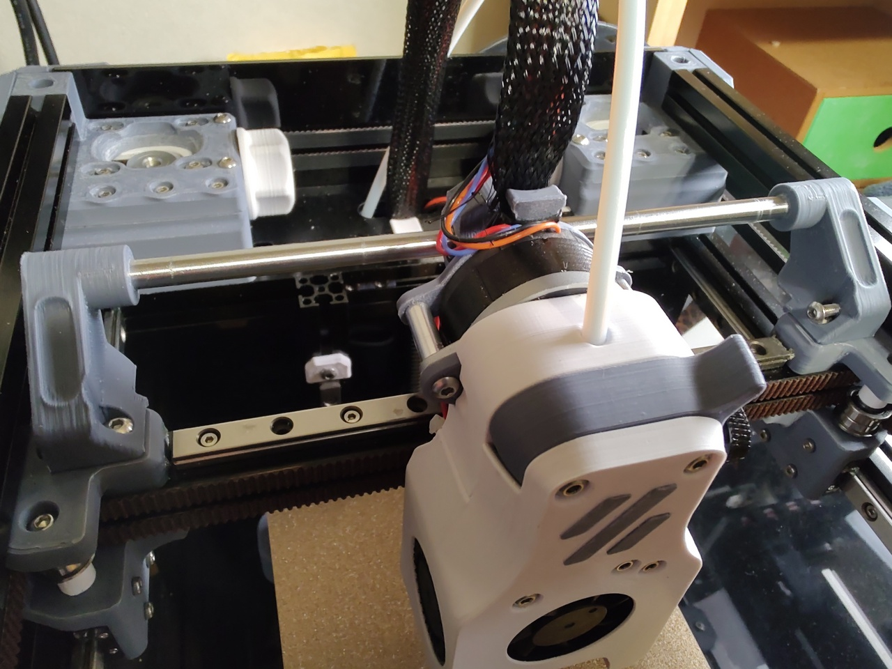
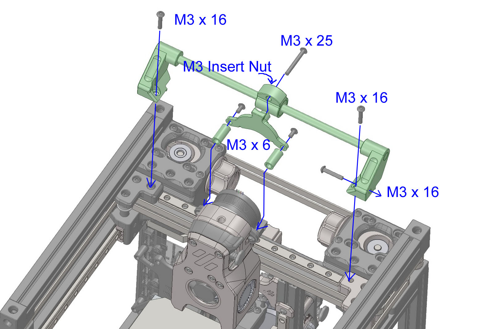
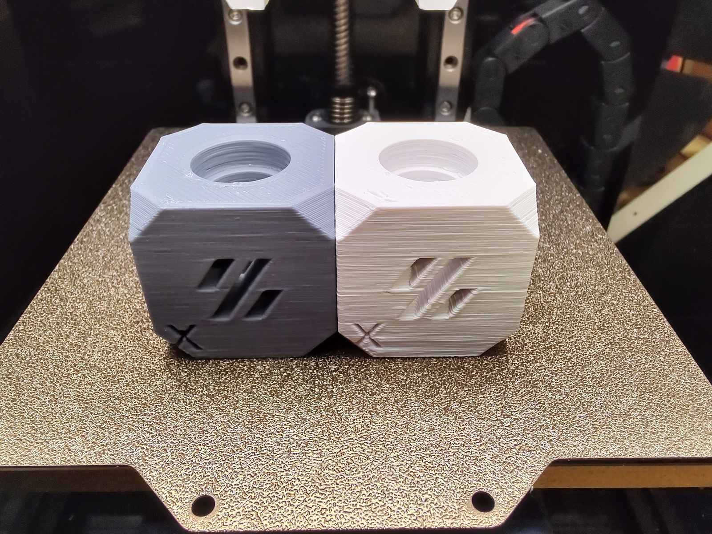
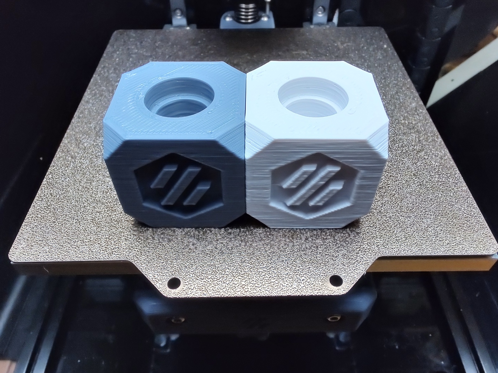
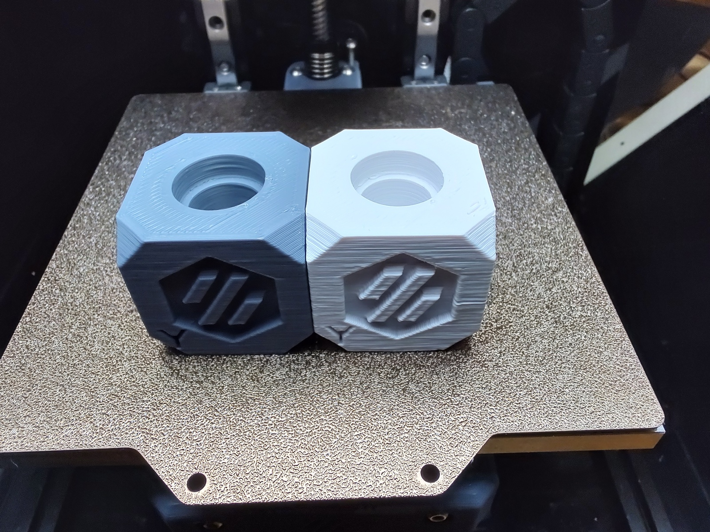

# v0.1 Tool head stabilizer
voron 0.1 tool head stabilizer   

## What is this?
The X-axis of v0.1 supports the tool head with only one linear rail, so the play of the linear rail causes the tool head to shake.  
This shaking is mainly due to the elasticity of the PTFE tubing and cable, which changes as the tool head moves, and the accelerated G.
Therefore, if I push it to one side of the swaying range with a force slightly stronger than these stresses, it should stop wobbling.  

Of course, it is better to replace the linear rail with a more precise one, but before doing so, you can check the effect on the print quality originating from the play of the linear rail.  

## Caution
This mod does not increase the rigidity of the X axis. It simply supports the tool head from behind a bit to eliminate play.  
Also, since the load is concentrated on one side of the rail, there is a possibility of uneven wear over a long period of time.  

## Hardware
- 6mm OD x 190mm Length Linear Shaft x1
- LM6UU Linear Ball Bearing(6mm ID, 12mm OD, 19mm length) x1
- M3 x 15mm Aluminum Column Spacer x2
- M3 x 25mm BHCS x1
- M3 x 16mm BHCS x1
- M3 Insert Nut x1

## Assemble

## Print Samples
- White: Not using "Tool head stabilizer".
- Gray: Use "Tool head stabilizer".
- Same GCode file.

